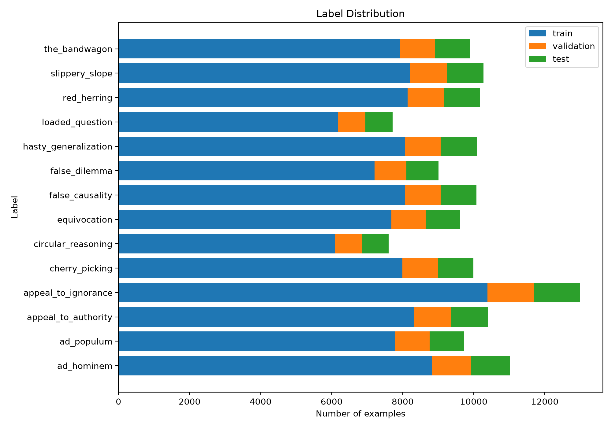
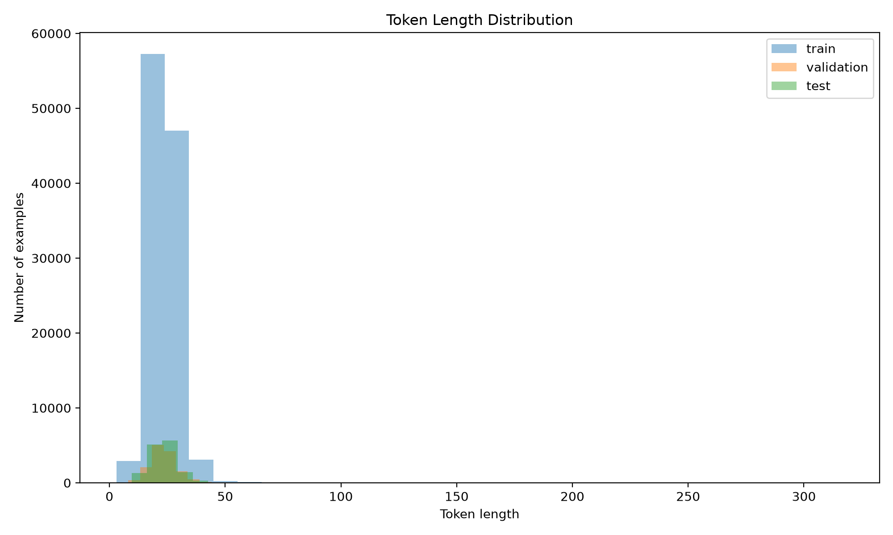
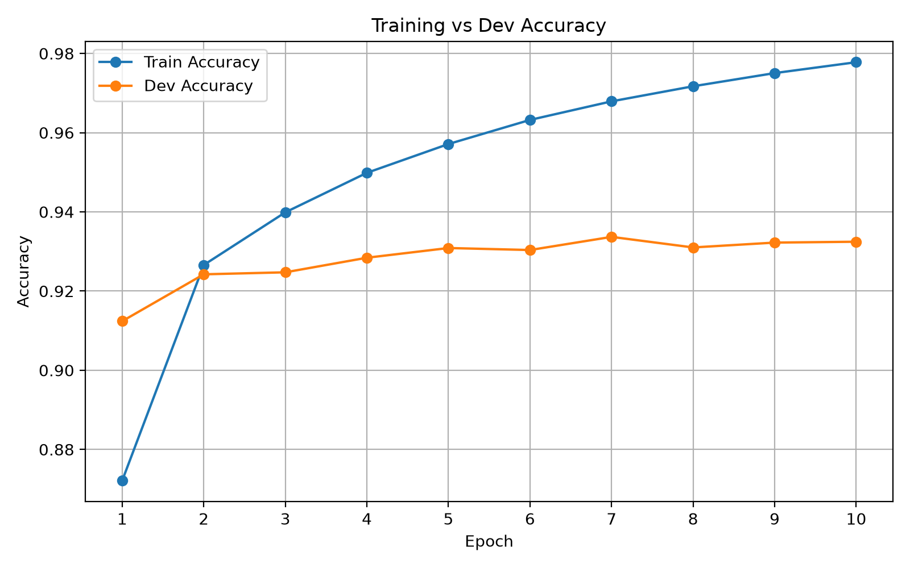
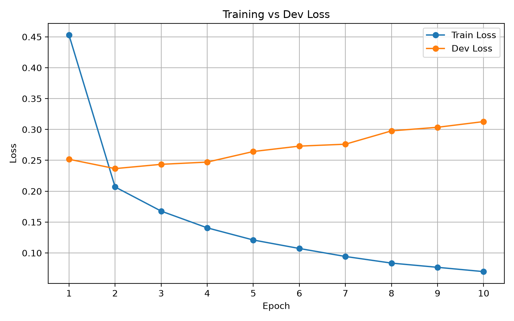
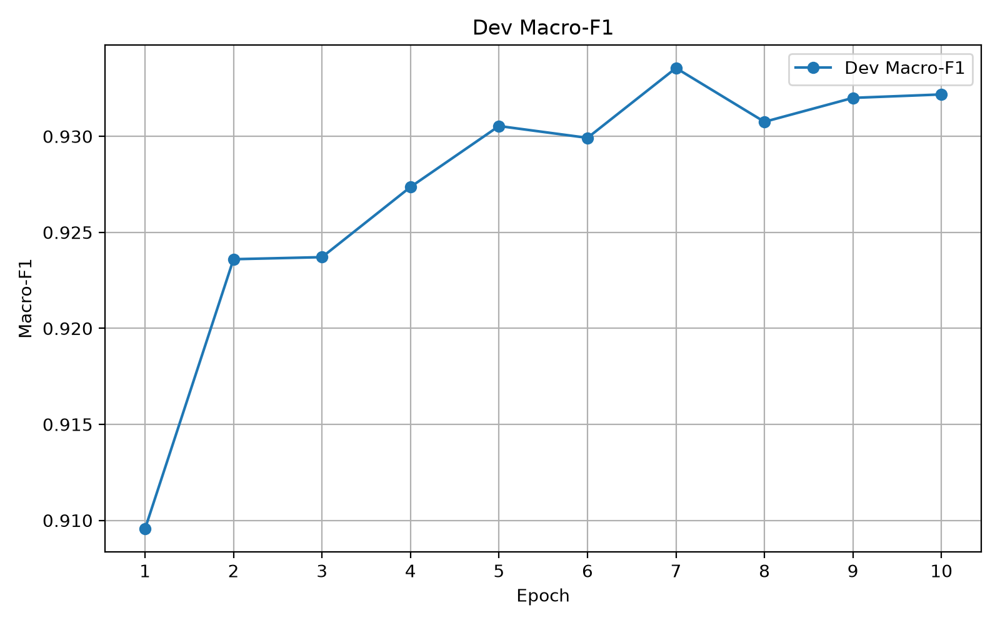
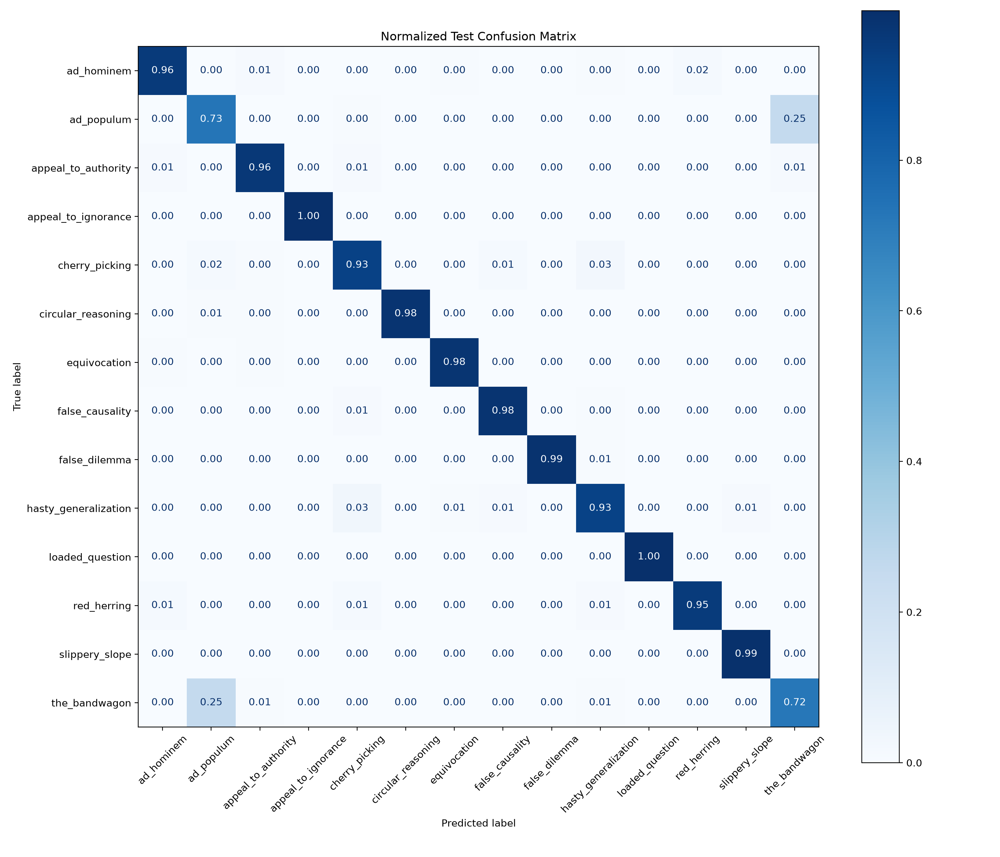
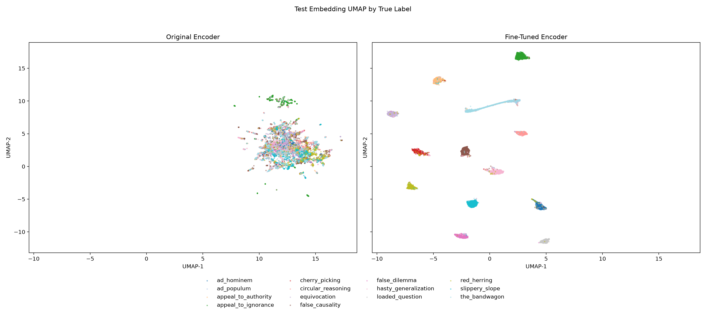

# Logical Fallacy Classifier

An end-to-end training and inference pipeline for classifying short arguments
into 14 logical fallacy categories. It uses pretrained Hugging Face encoders,
PyTorch, Accelerate, and Weights & Biases.

## Setup

The project uses `uv` with Python 3.13. `uv sync` creates `.venv` and installs
the locked dependencies; activate the environment before running the scripts.

```bash
uv sync
source .venv/bin/activate
```

The main tools each have a distinct role:

- **PyTorch** handles optimization, GPU execution, and inference.
- **Hugging Face** supplies the models, tokenizers, dataset pipeline, and metrics.
- **Accelerate** manages device placement, BF16 training, and gradient handling.
- **Weights & Biases** tracks runs and coordinates Bayesian hyperparameter sweeps.

The experiments reported here ran on one NVIDIA GeForce RTX 5070 Ti Laptop GPU
with 12 GB VRAM and CUDA 13.2. Training used BF16 mixed precision and batches of
16 examples.

## Dataset

The current benchmark is the
[`kuwrom/fallacy`](https://huggingface.co/datasets/kuwrom/fallacy) classification
dataset. It contains 138,574 short arguments across 14 classes, split into
110,859 training, 13,857 validation, and 13,858 test examples.

The external CoCoLoFa and Touché sources are stored separately under `datasets/`.
Their cleaned combined file is `datasets/cocolofa_touche_combined.csv`; it is
reserved for the next fine-tuning phase and is not used by the current pipeline.





## Models

Each pretrained encoder is fine-tuned end to end with a new classification head
for the 14 fallacy labels.

- [`microsoft/deberta-v3-base`](https://huggingface.co/microsoft/deberta-v3-base)
  is the default because it produced the best validation Macro-F1 while retaining
  a practical accuracy-to-compute balance.
- [`answerdotai/ModernBERT-base`](https://huggingface.co/answerdotai/ModernBERT-base)
  supports inputs up to 8,192 tokens and provides a comparison for longer
  arguments and documents.
- [`sentence-transformers/all-MiniLM-L6-v2`](https://huggingface.co/sentence-transformers/all-MiniLM-L6-v2)
  is much smaller, making it the best option here for fast, low-memory inference.

## Hyperparameter Optimization

Hyperparameter optimization (HPO) searches for training settings, such as the
learning rate and weight decay, that give the best validation performance.
Unlike model weights, these settings are chosen before each training run.

Weights & Biases (W&B) records each run's configuration and metrics so experiments
can be compared. W&B Sweeps automates HPO by coordinating runs with different
settings from a search space defined in a YAML file. This project uses Bayesian
search, which uses previous results to choose promising settings, and maximizes
validation Macro-F1, which gives each fallacy class equal weight.

Create a sweep, then start an agent with the returned sweep ID:

```bash
wandb sweep configs/sweep.yaml
wandb agent --count 6 <entity>/<project>/<sweep-id>
```

The Bayesian sweep optimizes validation Macro-F1 and deliberately skips test
evaluation. After selecting the best configuration, place those values in
`config.py` and run `main.py` once for the final test result.

Use the model-specific files when every architecture must receive its own
hyperparameter search:

```text
configs/sweep_deberta.yaml
configs/sweep_modernbert.yaml
configs/sweep_minilm.yaml
```

## Training

Run the default configuration with:

```bash
python3 main.py
```

The defaults are defined in `config.py`:

```text
dataset: kuwrom/fallacy classification
model: microsoft/deberta-v3-base
mixed precision: bf16
batch size: 16
epochs: 10
```

Validation runs after every epoch and controls early stopping and best-model
selection. A normal run then evaluates the restored best model once on the test
split. It saves the model under `checkpoints/best_model/<run-id>/`, saves test
evaluation artifacts under `plots/evaluation/<run-id>/`, and logs the detailed
test results to W&B.

The following curves are from the best All-MiniLM run, `8wfncto3`. The plots use
"dev" as another name for the validation split.

### Accuracy



Training accuracy continues to improve while validation accuracy levels off near
93%, showing a growing generalization gap in later epochs.

### Loss



Validation loss reaches its minimum around epoch 2 and then rises as training
loss falls. This indicates that the model becomes increasingly overconfident
without comparable validation improvement.

### Macro-F1



Validation Macro-F1 peaks at `0.9336` in epoch 7. The training loop selects and
restores this checkpoint instead of retaining the final epoch.

## Inference

`predict.py` loads a saved model and predicts labels for a list of sentences.
Set `model_path` and `sentences` in its `__main__` block, then run:

```bash
python3 predict.py
```

The included example uses the best completed All-MiniLM checkpoint and prints a
label and confidence score for each sentence.

## Outputs

Local runs write artifacts to:

```text
checkpoints/
plots/
wandb/
```

Git ignores those runtime outputs except for the plots embedded in this README.
Raw dataset downloads are also ignored, while the cleaned combined CSV can be
committed.

## Results

Best completed Kuwrom runs:

| Model | Run | Best Validation Macro-F1 | Test Accuracy | Test Macro-F1 |
| --- | --- | ---: | ---: | ---: |
| `microsoft/deberta-v3-base` | `l1k8t4wj` | 0.9391 | 0.9411 | 0.9409 |
| `answerdotai/ModernBERT-base` | `7bpgpfq2` | 0.9377 | 0.9395 | 0.9391 |
| `sentence-transformers/all-MiniLM-L6-v2` | `8wfncto3` | 0.9336 | 0.9358 | 0.9358 |

### Hyperparameters

| Model | Learning Rate | Weight Decay | Warmup Ratio | Batch Size |
| --- | ---: | ---: | ---: | ---: |
| `microsoft/deberta-v3-base` | `3e-5` | `0.01` | `0.00` | `16` |
| `answerdotai/ModernBERT-base` | `3e-5` | `0.01` | `0.06` | `16` |
| `sentence-transformers/all-MiniLM-L6-v2` | `2e-5` | `0.01` | `0.00` | `16` |

All three runs used a maximum of 10 epochs, early-stopping patience of 3,
gradient clipping at `1.0`, seed `42`, and BF16 mixed precision.

## Analysis

### Confusion Matrix



Most predictions lie on the diagonal, showing clean separation between the
majority of classes. The main exception is the symmetric confusion between
`ad_populum` and `the_bandwagon`: approximately 25% of each class is assigned to
the other, making this the dominant class-level error.

### Embedding UMAP



The UMAP gives a qualitative view of how fine-tuning reshapes the All-MiniLM
test embeddings.

- The original encoder places most labels in one broad mixed region, with only
  weak local structure.
- The fine-tuned encoder forms compact, label-specific clusters, matching the
  strong diagonal in the confusion matrix and the high F1 scores for most
  classes.
- The main remaining issue is narrow label boundaries: related classes such as
  `ad_populum` and `the_bandwagon` still behave like nearby decision regions.
- The plot should be read as qualitative structure, not as a precise distance
  map.

### Per-Class F1

| Performance | Classes |
| --- | --- |
| Highest | `appeal_to_ignorance` 0.998, `loaded_question` 0.996, `slippery_slope` 0.990, `false_dilemma` 0.989 |
| Strong | `circular_reasoning` 0.980, `false_causality` 0.977, `equivocation` 0.975, `ad_hominem` 0.964, `appeal_to_authority` 0.962, `red_herring` 0.960 |
| Moderate | `hasty_generalization` 0.930, `cherry_picking` 0.928 |
| Weak | `the_bandwagon` 0.727, `ad_populum` 0.721 |

The two weakest labels differ as follows:

- **Ad populum:** treats widespread belief as evidence that a claim is true.
- **Bandwagon:** argues that someone should adopt a belief or behavior because
  many others already have.

Bandwagon is often considered a subtype of ad populum, so this narrow annotation
boundary likely contributes to both weak F1 scores.

### Tests

The saved All-MiniLM checkpoint (`8wfncto3`) was evaluated on the easy examples
and the mapped CoCoLoFa/Touché dataset using `predict.py`.

| Dataset | Examples | Correct | Accuracy |
| --- | ---: | ---: | ---: |
| `easy_synthetic_test.csv` | 13 | 12 | 92.31% |
| `hard_real_test.csv` | 3,746 | 1,775 | 47.38% |

- **Easy examples:** nine synthetic examples and four external samples. The only
  error was `hasty_generalization` predicted as `appeal_to_authority` with 99.83%
  confidence. This small, selected set is a sanity check, not a general benchmark.
- **Hard examples:** all source splits were included. The original test split
  alone scored 44.39% (178/401). The model overpredicts `slippery_slope`, assigning
  it to 1,565 examples when only 711 carry that label. The largest errors are
  `red_herring` (270), `hasty_generalization` (234), and `false_dilemma` (227)
  predicted as `slippery_slope`.
- **Confidence and likely causes:** 1,199 of the 1,971 hard-set errors had at
  least 90% confidence. The results suggest limited transfer to external text;
  different writing styles and overlapping fallacies may contribute. No hard-set
  input exceeded the tokenizer's 512-token limit, so truncation does not explain
  these errors.
- **Mapping caveat:** `appeal_to_majority` was mapped to `ad_populum`, and
  `appeal_to_worse_problems` to `red_herring`; these are approximate matches.
  Accuracy on the four unchanged label categories was 55.62% (2,492 examples).
  The hard set excludes `none`, `appeal_to_nature`, and `appeal_to_tradition`.
